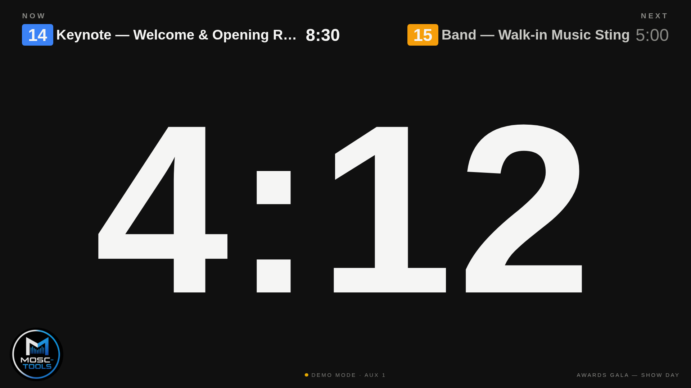
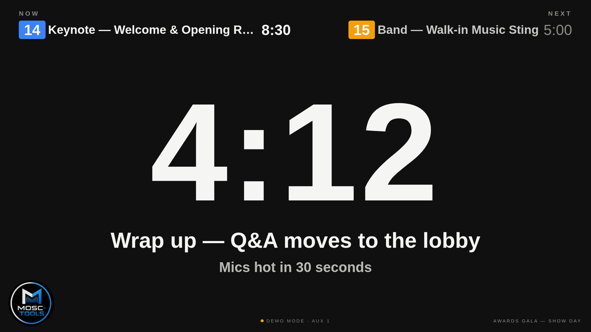
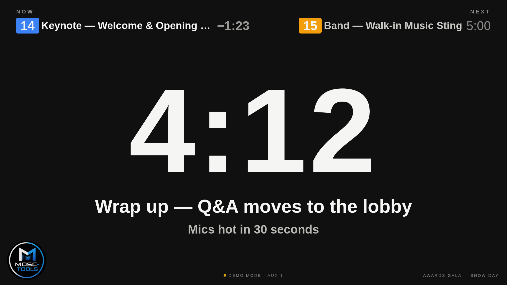

  

<h1 align="center">Mosc-tools — Ontime AUX Timer</h1>

  A fullscreen, broadcast-clean AUX timer for <a href="https://www.getontime.no/">Ontime</a>. 
  One HTML file. No install, no build, no internet. Drop it on any screen on your show network.

  
  &nbsp;
  
  &nbsp;
  

## Why

Ontime's built-in views are great for stage timers — but sometimes you want the **AUX timer**
front and center on a confidence monitor, with just enough rundown context to keep everyone
oriented and none of the clutter. That's this: a giant AUX countdown, the cue that's running,
and the cue that's next. Nothing else.

Built for real show conditions: it runs from a single file on a closed network, uses system
fonts only, survives network drops, and never surprises you with a color you didn't ask for.

## What you get

- **Giant AUX timer** — auto-sized to the screen, smooth local ticking between server updates.
  Amber under 3 minutes, red under 1, flashing red past zero, dimmed when paused,
  dashes (`–:––`) when idle — and completely blank when the timer is cleared (stopped and
  set to `00:00:00`, e.g. by a show-flow row with `Aux Timer` = `00:00:00`), so the screen
  shows nothing until the next automation sets a new time.
- **NOW & NEXT cue bar** (top) — cue number chips in the event's Ontime colour, event titles,
  a live master countdown beside the running cue, and the scheduled duration of the next one.
- **Discreet corner timers** — the segment countdown stays white, counts through zero, then
  keeps counting up with a minus sign in calm grey. No yellow, no red, no flashing where
  presenters can see it.
- **Timer messages** — Ontime's timer message and secondary message appear under the clock
  when you show them; the clock shrinks to make room, then reclaims the space.
- **Blink & blackout** — both Ontime buttons work exactly as they do on built-in views.
- **Rundown name & branding** (bottom) — current rundown title fetched live, Mosc-tools mark,
  and a connection pill with the server IP. **Click the IP to change it** — type a new address
  right on screen (port optional, `4001` assumed), press Enter, and the page reconnects and
  remembers it on that device.
- **10-second heartbeat** — the page actively pings the Ontime host; if the host stops
  answering, the pill's dot goes red within seconds and the socket is forced through a
  reconnect cycle. Green again on recovery, no refresh needed.
- **Ontime v3 & v4** — speaks both WebSocket protocols, auto-detects the message shape.

## Quick start

The file ships pointed at `10.1.1.100:4001` — change one line or use a URL parameter.

**Option 1 — just open it.** [Download the zip](https://github.com/professorpete/mosc-tools-ontime-aux-timer/archive/refs/heads/main.zip),
unzip, and open `index.html` on any machine on the show network. Double-click the page for
fullscreen. (Or grab the file straight from the [latest release](https://github.com/professorpete/mosc-tools-ontime-aux-timer/releases/latest).)

Want to see it before you download? The [live demo](https://professorpete.github.io/mosc-tools-ontime-aux-timer/?demo=1)
runs the exact same file with fake show data.

**Option 2 — serve it from Ontime itself.** Drop the file in a folder inside Ontime's
`external` directory (e.g. `external/aux/index.html`), then open
`http://<ontime-ip>:4001/external/aux/` from any device on the network — laptops, tablets,
signage players, anything with a browser.

**Option 3 — host it anywhere.** It's a static file; any web server works. Point it at your
Ontime machine with `?server=`.

### URL parameters

| Parameter | What it does | Default |
| --- | --- | --- |
| `?server=192.168.1.50:4001` | Ontime host to connect to | `10.1.1.100:4001` |
| *(none — on-screen)* | Click the IP pill at the bottom to set the address without any URL editing; it's saved in the browser | — |
| `?aux=1` / `?aux=2` / `?aux=3` | Which AUX timer to display | `1` |
| `?demo=1` | Demo mode with fake show data (for testing looks) | off |

To change the baked-in default server, edit the `DEFAULT_SERVER` line near the top of the
script in `index.html`.

## How it talks to Ontime

- **WebSocket** (`ws://<server>/ws`) for everything live: AUX timer, running/next events,
  master timer, messages, blink/blackout. Reconnects automatically with backoff.
- **HTTP** for the rundown title (`/data/rundowns/current` on v4, `/data/project` on v3)
  and for the 10-second host heartbeat.

## Make it yours

All colors live in one `:root` block at the top of the file — background, warning amber,
danger red, the NOW accent blue. The layout is plain CSS with viewport units; it scales from
a phone to a 4K wall without media queries.

## Support

Questions or ideas: [mosc-tools@moscone.ca](mailto:mosc-tools@moscone.ca)

If this tool saved your show day, consider
[buying me a coffee](https://buymeacoffee.com/mosctools) ☕ — it keeps the Mosc-tools
side projects alive.

MIT licensed.
